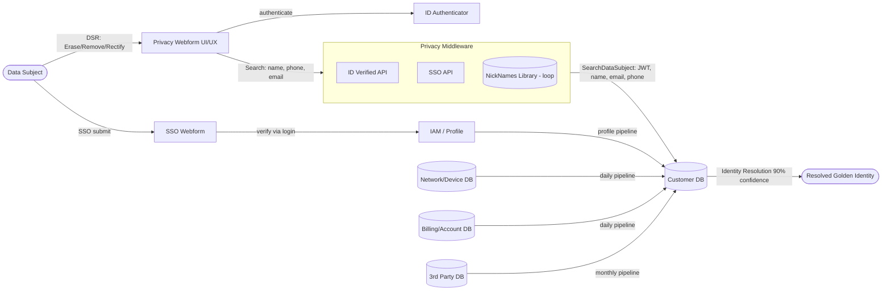

# Architecture

## Flow

## Components (code mapping)

| Diagram element | Code |
|---|---|
| NickNames Library loop | `normalize.NICKNAMES`, `canon_first` |
| Field normalization | `normalize.py` (`norm_phone`, `norm_email`, `split_name`) |
| Privacy Middleware / SearchDataSubject | `api.py` `/v1/search-data-subject`, `/v1/dsr` |
| Customer DB fan-in | `loader.build_resolver` loads 4 sources into `Resolver.pool` |
| Identity Resolution (90% confidence) | `engine.score_pair` + `AUTO_MERGE` band |
| Daily/monthly data pipelines | `scripts/generate_data.py` simulates source feeds |

## Matching design

The engine is a transparent probabilistic matcher rather than a black-box model, so
every decision is auditable - a hard requirement in a privacy/compliance context.

**Blocking.** Each record is indexed under several cheap keys: full email, phone
last-4, and a 4-char surname prefix. A query is only scored against records sharing
at least one key, turning an O(n²) cross-join into near-linear lookup.

**Scoring.** Field-level evidence is summed with explicit weights (email and phone
dominate; name and state are supporting signals), capped at 1.0. Weights live in one
dict in `engine.py` and are the primary tuning surface.

**Bands.** Confidence maps to AUTO_MERGE (>= 0.90), REVIEW (0.62-0.90), or NO_MATCH.
The gap between bands is deliberate: the system would rather send a borderline case
to a human than risk a wrong merge.

## Name handling

Names are parsed into **first / last / middle** with suffixes (Jr, Sr, III) stripped
and `Last, First Middle` order normalized. The first name is canonicalized through the
NickNames Library. The middle name is a supporting signal: matching middles add a small
boost, an initial-vs-full-name (`A.` vs `Ann`) is a partial match, and *disagreeing*
middles (`Ann` vs `Beth`) apply a penalty - the one case where a name field actively
argues against a merge. A missing middle is treated as no evidence, never a penalty.

## Self-improving NickNames Library

The library is no longer static. When an analyst confirms a REVIEW-band match,
`feedback.confirm_match` decides what to learn:

- It only proposes a nickname when the evidence shows the **first name was the gap**
  (a strong identifier - email or phone - carried the match, and the first name did
  not match exactly). A confirmed match caused by a typo'd surname or stale phone
  teaches nothing about nicknames.
- A proposed pair is **staged**, not applied. It is promoted into the active library
  only after enough *distinct* analysts confirm it (`PROMOTE_AT`), so one analyst's
  error cannot poison future matching.
- Promoted pairs persist to `data/nicknames.json` with a full audit log in
  `data/nickname_proposals.json` (who confirmed, when), so any learned mapping can be
  reviewed or rolled back.

The payoff: every analyst decision in the REVIEW band makes the next resolution
smarter, so the auto-merge rate rises and manual review shrinks over time. Exposed via
`POST /v1/feedback`.

## Scaling notes

- Blocking keys move to a real index (Elasticsearch / a KV store) at production scale.
- Per-source adapters (`Entity.from_record`) isolate schema differences, so adding a
  source is one branch, not an engine rewrite.
- The learned-matcher upgrade path: keep the same evidence features, replace the
  fixed weights with a trained Fellegi-Sunter or gradient-boosted model, keep the
  band-based decision and the evidence output for explainability.
